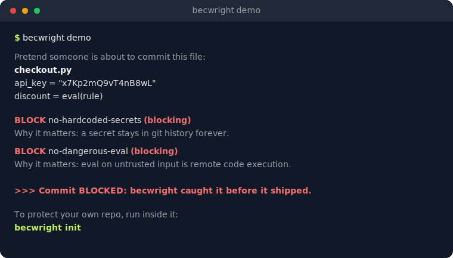

> [English](README.md) · **Español**

<p align="center">
  
</p>

# becwright

[](https://github.com/DataDave-Dev/becwright/actions/workflows/ci.yml)
[](https://www.npmjs.com/package/becwright)
[](https://pypi.org/project/becwright/)

**La capa de enforcement para agentes de IA.**

Reglas que se ejecutan, no notas que se ignoran. Tu `CLAUDE.md` es un *cartel*;
becwright es el *guardia* — corre tus reglas sobre el código y frena el commit
cuando una se rompe, sin importar qué modelo (o persona) lo escribió.

<sub>Determinista, no probabilístico · cualquier lenguaje · sin Python · frena el commit **y** lleva el *por qué*.</sub>

<sub>Dogfooding — cada commit de este repo lo controlan las propias reglas de becwright ([`.bec/rules.yaml`](.bec/rules.yaml)) en CI.</sub>

## Antes / después

Un agente escribe `checkout.py` — una API key hardcodeada, un `eval()` sobre un
string de promo — y deja una nota para *"limpiar esto después."* Nadie lo hace.
Se publica.

Con becwright, el commit no llega a existir:

<p align="center">
  
</p>

> **Velo vos mismo en 5 segundos** — sin configurar nada, sin git, sin tocar tu
> máquina:
> ```bash
> npx becwright demo        # sin instalar   ·   o: pipx run becwright demo
> ```

## Por qué un guardia, no un cartel

Un agente de IA escribe un módulo y deja una nota: *"esto nunca debe loguear
tokens de sesión."* Meses después otro agente lo regenera, nunca lee la nota, y
el token termina en los logs. Nadie se entera hasta que explota en producción.

Un cartel *pide*; un guardia *revisa*. Justo antes de guardar tu trabajo,
becwright corre tus reglas sobre el código: ✅ si todo pasa → el commit entra;
❌ si una regla se rompe → te frena, te dice qué regla es y su *por qué*, y
espera hasta que lo arregles. Una nota en `CLAUDE.md` es **probabilística** —
depende de que el agente lea y obedezca. Una regla becwright es **determinista**
— se ejecuta sobre el código real y da pasa/no-pasa, sin importar qué modelo
hizo el cambio:

| | Nota en CLAUDE.md | Regla becwright |
|---|---|---|
| Qué hace | *Pide* que se respete | *Verifica* que se respetó |
| Depende de | Que el agente la lea y obedezca | Nada — se ejecuta sobre el código |
| Resultado | Probable | Garantizado |
| Analogía | Letrero de "velocidad máxima" | Tope físico en la calle |

Las dos capas son complementarias: `CLAUDE.md` previene (que el 95% salga bien a
la primera), becwright es la red de seguridad para el 5% que se cuela.

<details>
<summary><strong>¿Primera vez con commits y hooks?</strong> — el vocabulario en una caja</summary>

Un **commit** es una foto guardada de tu código en git. Un **hook** es un
pequeño script que git ejecuta solo en un momento determinado — becwright usa el
hook *pre-commit*, que se dispara justo antes de guardar un commit. Nunca lo
corrés a mano; lo hace git. El resto de este README va de "solo quiero empezar"
hasta el detalle técnico completo — leé hasta donde necesites.
</details>

## Concepto central: BEC (Bound Executable Constraint)

Una BEC es una constraint con tres propiedades que ningún artefacto actual
tiene juntas:

- **Bound (atada)** — la regla nace ligada a la *intención* y la decisión que
  la creó (el *por qué*), no es una regla suelta sin contexto.
- **Executable (ejecutable)** — lleva un chequeo que corre y devuelve
  pasa/no-pasa, no es prosa que alguien promete respetar.
- **Portable** — puede exportarse de un repo e importarse en otro, como un
  paquete (esto es lo que genera el efecto de red a futuro).

## Características

- **Cumplimiento determinista** — una regla es un chequeo real que corre sobre tu
  código y da pasa/no-pasa, no una nota que un agente puede ignorar.
- **Frena el commit, no solo avisa** — las reglas blocking detienen
  `git commit`; las warning informan sin frenar.
- **Cualquier lenguaje** — el motor matchea globs y corre un comando; usá el
  `forbid` sin código (regex) para Python, JS/TS, Go, Rust o lo que sea.
- **Deriva reglas de tu `CLAUDE.md`** — `becwright init --from-claude-md` convierte
  las prohibiciones que reconoce (secretos, `eval`, `debugger`, `console.log`,
  breakpoints, un límite de líneas por archivo, …) en reglas enforzables; un agente
  de IA puede extenderlo por MCP. Lo de criterio se queda en `CLAUDE.md`.
- **Se adopta en cualquier código** — `--baseline` arranca en `warning` las reglas
  que *ya* tienen violaciones, así un repo legacy no se frena el día uno; graduás
  cada una a blocking a medida que la limpiás.
- **Reglas garantizadas *y* asistidas** — las deterministas `block` con garantía
  al 100%; las de criterio (legibilidad, diseño) viven como `advisory` — informan
  con un revisor tuyo (p. ej. un LLM) pero nunca bloquean, y quedan etiquetadas
  para que siempre sepas qué está garantizado y qué es best-effort.
- **Atada al _por qué_** — cada regla lleva su intención y su razón, que se
  muestran cuando se dispara.
- **Checks incluidos** — `forbid` / `require` (un patrón que *debe* estar) /
  `max_lines` / `filename`, más checks de secretos, `eval`, debug e imports — con
  `exclude:` por regla para silenciar falsos positivos.
- **BECs portables** — `export` de una regla a un `.bec.yaml` e `import` en otro
  repo; los checks custom viajan con su código.
- **Catálogo offline** — `becwright search` / `add` instalan reglas listas sin
  URL, empaquetadas dentro del paquete.
- **Sin Python** — instalá por npm/pnpm como binario autónomo, o por pip/pipx.
- **Se adapta a tu setup** — hook de git nativo, o enchufado al framework
  pre-commit o a Husky.
- **No se puede saltar** — una GitHub Action corre becwright en cada PR (solo los
  archivos que cambió), así un check obligatorio hace cumplir las reglas aunque el
  hook local se saltee con `--no-verify`.
- **Listo para agentes de IA** — plugin de Claude Code, `check --json` y un
  servidor MCP con tools para que un agente proponga, previsualice y agregue reglas
  desde tu `CLAUDE.md`.
- **Chico y confiable** — dependencias mínimas (`pyyaml`), sin `eval`/`exec`, con
  dogfooding en CI.

## Casos de uso

- **Convertí tu `CLAUDE.md` en guardarraíles** — lo determinista pasa a BECs que no
  se pueden ignorar; lo de criterio se queda como prosa.
- **Adoptá gradualmente en un repo legacy** — `--baseline` avisa sobre la deuda
  existente sin frenar commits, y después apretás a blocking regla por regla.
- **Frenar secretos antes de que entren** — API keys, tokens, claves privadas,
  contraseñas hardcodeadas.
- **Que no queden restos de debug** — `breakpoint()`, `pdb`, `debugger;`,
  `console.log`, `dbg!`, `panic()` olvidados.
- **Prohibir APIs riesgosas / hacer cumplir convenciones** — `eval` / `exec`, un
  límite de líneas por archivo, reglas de nombre de archivo, o cualquier patrón que
  vetes con una regla regex de una línea.
- **Reglas sobre el mensaje del commit** — Conventional Commits, o bloquear líneas
  de atribución de IA, con una regla `target: commit-msg` y el hook `commit-msg`.
- **Proteger código escrito por IA** — la red determinista para lo que un agente
  regenera y olvida.
- **Hacer cumplir convenciones del equipo** — codificá una decisión una vez como
  BEC y compartila entre todos los repos.

## Cómo se usa

becwright se instala una vez; cada proyecto solo agrega un `.bec/rules.yaml`
chico. **Dos pasos y listo.**

**1. Instalar** — una línea:

```bash
npm install -g becwright
```

<details>
<summary>¿Preferís pnpm, pip, o instalación local al proyecto? →</summary>

```bash
pnpm add -g becwright
pipx install becwright                # o: pip install becwright
npm install --save-dev becwright      # local al proyecto; el hook lo encuentra en node_modules/.bin
```

Por npm/pnpm **no hace falta Python** — viene un binario autónomo por plataforma
(`linux-x64`, `linux-arm64`, `darwin-x64`, `darwin-arm64`, `win32-x64`). En
cualquier otra plataforma, usá `pipx install becwright`.
</details>

**2. Configurarlo** — dentro de tu proyecto:

```bash
becwright init   # detecta tu lenguaje, escribe .bec/rules.yaml, instala el hook pre-commit
```

Listo. A partir de ahora cada `git commit` corre los chequeos solo, y frena un
commit que rompa una regla blocking. No volvés a llamar a becwright a mano.

**¿Adoptándolo en un código que ya existe?** Usá `becwright init --baseline`: las
reglas que *ya* tienen violaciones arrancan en `warning` (no se frena nada
legítimo) y las limpias arrancan en `blocking`. Limpiá la deuda con el tiempo y
después graduá cada regla a `blocking`.

**¿Ya tenés un `CLAUDE.md`?** `becwright init --from-claude-md` lo lee y convierte
las prohibiciones que reconoce (secretos, `eval`, `debugger`, `console.log`,
breakpoints, …) en reglas enforzables — la red determinista debajo de la prosa.
Lo de criterio se queda en `CLAUDE.md`. Revisá el resultado; combinalo con
`--baseline` para adoptar en un repo sucio de una.

Instalado como devDependency, el hook de pre-commit resuelve el binario local
desde `node_modules/.bin`, así funciona sin instalación global. Los paquetes npm
cubren `linux-x64`, `linux-arm64`, `darwin-x64`, `darwin-arm64` y `win32-x64`; en
cualquier otra plataforma usá `pipx install becwright`.

Comandos disponibles:

| Comando | Qué hace |
|---|---|
| `becwright demo` | Muestra a becwright frenando un commit malo de ejemplo (sin configurar nada, sin git) |
| `becwright init` | Genera un `.bec/rules.yaml` de arranque e instala el hook |
| `becwright init --baseline` | Igual, pero arranca en `warning` las reglas que ya tienen violaciones (adoptar sin frenar commits) |
| `becwright init --from-claude-md` | Deriva reglas del `CLAUDE.md` del repo (best-effort) |
| `becwright list` | Lista los checks incluidos |
| `becwright check` | Corre las reglas sobre los archivos en staging |
| `becwright check --diff <base>` | Corre las reglas solo sobre los archivos cambiados vs `<base>` (para CI/PR) |
| `becwright why [id]` | Muestra la intención + el por qué de las reglas — la memoria de decisiones del repo (`--json` para agentes) |
| `becwright search [texto]` | Lista BECs listas del catálogo incluido |
| `becwright add <nombre>` | Instala una BEC del catálogo en `.bec/rules.yaml` (sin conexión) |
| `becwright install` | Instala el hook `pre-commit` nativo |
| `becwright uninstall` | Quita el hook |
| `becwright export <id>` | Exporta una BEC a un archivo `.bec.yaml` |
| `becwright import <archivo\|URL>` | Importa una BEC de otro repo |

### ¿Ya usás pre-commit o Husky?

Si tu repo ya administra los git hooks, becwright se enchufa sin `becwright
install`.

**[pre-commit](https://pre-commit.com)** — agregá esto a `.pre-commit-config.yaml`:

```yaml
repos:
  - repo: https://github.com/DataDave-Dev/becwright
    rev: v0.3.0
    hooks:
      - id: becwright
```

**Husky** (repos JS/TS) — en `.husky/pre-commit`:

```sh
npx becwright check
```

En ambos casos becwright igual lee `.bec/rules.yaml` y frena el commit ante una
regla bloqueante rota. Solo necesitás `becwright init` una vez para generar las
reglas (salteá su instalación del hook si otra herramienta lo administra).

### Como check obligatorio de CI (GitHub Action)

El hook de commit es la primera línea de defensa, pero vive en la máquina de cada
persona — y `git commit --no-verify` lo saltea. Un **check obligatorio de CI no
se puede saltar**. Correr becwright en cada pull request convierte las reglas en
infraestructura del pipeline, no en una comodidad local que un agente (o un
humano) pueda esquivar.

Agregá `.github/workflows/becwright.yml`:

```yaml
name: becwright
on: pull_request

jobs:
  becwright:
    runs-on: ubuntu-latest
    steps:
      - uses: actions/checkout@v4
        with:
          fetch-depth: 0        # historia completa para que exista el merge-base con la base del PR
      - uses: DataDave-Dev/becwright@main   # fijá a un tag publicado cuando esté disponible
```

Por defecto chequea **solo los archivos que cambió el PR** contra la rama base —
la deuda preexistente en el resto del repo nunca rompe el build, así lo podés
adoptar en un código grande sin un muro rojo. Marcá el check como *required* en
las reglas de protección de rama y las reglas dejan de ser negociables.

Inputs (todos opcionales):

| Input | Default | Qué hace |
|---|---|---|
| `base` | rama base del PR | Ref de git contra la que diffear; solo se chequean los archivos cambiados vs ella |
| `version` | `becwright` | Especificador pip a instalar (ej. `becwright==0.4.0`) |
| `python-version` | `3.x` | Python con el que corre becwright |
| `args` | *vacío* | Args extra que se agregan a `becwright check` |

> Poné `fetch-depth: 0` en el checkout para que exista el merge-base con la base
> del PR; un clon shallow deja la ref base inalcanzable y el check falla de forma
> ruidosa en vez de pasar sobre una lista vacía de archivos.

¿Preferís correrlo vos? `becwright check --diff origin/main` hace lo mismo desde
cualquier step del workflow, sin necesidad de la action.

### Uso con agentes de IA (Claude Code)

becwright es la red determinista para lo que un agente de IA deja pasar. Hay un
plugin de Claude Code para que un agente lo instale y lo maneje por vos:

```text
/plugin marketplace add DataDave-Dev/becwright
/plugin install becwright@becwright
```

Agrega un skill `becwright` y un comando `/becwright`. Ver
[`integrations/claude-code/`](integrations/claude-code/).

Para resultados estructurados, `becwright check --json` imprime un resumen
legible por máquina, y `becwright mcp` (instalá el extra `mcp`: `pipx install
"becwright[mcp]"`) levanta un servidor MCP — MCP es una forma estándar de que
las herramientas de IA se conecten a habilidades extra — que expone `check`,
`list_checks` y `list_rules` a cualquier agente. Ver [`documentation/mcp.md`](documentation/mcp.md).

Mejor aún, un agente puede leer las reglas *antes* de escribir código: `becwright
why --json` le entrega las decisiones que no puede violar (la intención de cada
regla y su razón), así las esquiva en vez de descubrir la regla recién cuando el
commit se bloquea. El catálogo `.bec/rules.yaml` se vuelve la memoria de
decisiones consultable del repo.

En ambos casos la señal se mantiene magra. Un commit bloqueado devuelve la única
regla que se rompió, su *por qué* y las líneas exactas — el agente arregla justo
eso en vez de releer la guía de estilo entera en el contexto. El consejo de
siempre es "dale más contexto al modelo"; becwright lo da vuelta — le pasás la
constraint puntual que rompió, verificada de forma determinista, no el reglamento
completo. Menos tokens, loop más ajustado, y la garantía no depende de que el
modelo haya leído nada.

Una regla en `.bec/rules.yaml`:

```yaml
rules:
  - id: no-token-in-logs
    intent: >
      Los tokens de sesión y credenciales nunca deben llegar a ningún log.
    why_it_matters: >
      Si un token aparece en los logs, cualquiera con acceso a ellos puede
      robar la sesión de un usuario.
    paths: ["src/**/*.py"]
    exclude: ["src/logging_setup.py"]   # opcional: globs restados de paths
    check: "becwright run no_token_in_logs"
    severity: blocking   # blocking = frena el commit | warning = solo avisa
```

`exclude` resta globs de `paths`, así una sola regla puede cubrir todo un
lenguaje salteando los archivos que solo darían falsos positivos — código
vendored o generado, o la implementación del propio check. Viaja con la regla en
`export` / `import`. Referencia completa de campos:
[`documentation/usage.es.md`](documentation/usage.es.md).

## Cómo se compara becwright

becwright no es un linter ni solo un lanzador de hooks — es la capa que hace que
una *regla* sea portable y esté atada a su razón, y que frena el commit por ella.

| | becwright | pre-commit / Husky | gitleaks / linters | CLAUDE.md / .cursorrules |
|---|:---:|:---:|:---:|:---:|
| Corre un chequeo real | ✅ | ✅ (corre otras herramientas) | ✅ | ❌ prosa |
| Frena el commit | ✅ | ✅ | ✅ | ❌ |
| Lleva el *por qué* (intención) | ✅ | ❌ | ❌ | ⚠️ no se exige |
| Regla portable entre repos | ✅ `export`/`import` | ⚠️ copiar config | ⚠️ | ⚠️ |
| Cualquier lenguaje, sin plugin por herramienta | ✅ `forbid` regex | ⚠️ | ❌ atado a la herramienta | n/a |

becwright los **complementa** en lugar de reemplazarlos: corré gitleaks o un
linter *como* un check de becwright, o agregá becwright *dentro* de pre-commit /
Husky. La diferencia es que una BEC ata la regla a su intención y viaja entre
repos.

## Checks incluidos

becwright trae chequeos listos para usar. Cada uno es un módulo que se invoca
desde el campo `check`. Funcionan **buscando texto** dentro de tus archivos con
un patrón (un *regex* — un patrón de búsqueda de texto, tipo "encontrá esta
palabra exacta"), en vez de entender el código de verdad. Eso los hace simples y
predecibles: pueden pasar por alto casos raros, y el verdadero valor está en
atar cada regla a su *por qué*.

| Check | Qué detecta | Lenguaje | Severidad sugerida |
|---|---|---|---|
| `forbid` | Cualquier regex que le pases (`--pattern`) | cualquiera | según el caso |
| `require` | Un regex (`--pattern`) que *debe* aparecer (p. ej. un header de licencia) | cualquiera | según el caso |
| `max_lines` | Archivos con más de `--max` líneas | cualquiera | `warning` |
| `filename` | Nombres de archivo que matchean `--forbid` o no matchean `--require` | cualquiera | según el caso |
| `no_token_in_logs` | Tokens/credenciales en llamadas a logs | Python | `blocking` |
| `hardcoded_secrets` | Claves AWS, claves privadas, `password = "..."` literales | cualquiera | `blocking` |
| `debug_remnants` | `breakpoint()`, `pdb.set_trace()`, `import pdb` olvidados | Python | `blocking` |
| `dangerous_eval` | Llamadas a `eval()` / `exec()` | cualquiera | `blocking` |
| `conflict_markers` | Marcadores de conflicto de merge olvidados (`<<<<<<<`) | cualquiera | `blocking` |
| `wildcard_imports` | `from x import *` | Python | `warning` |

## Reglas listas para usar (sin escribir nada)

¿No querés escribir reglas vos mismo? El catálogo viaja **dentro** de becwright,
así que instalás una regla con un solo comando — sin URL y sin conexión.
becwright te muestra la regla y después la deja en tu `.bec/rules.yaml`, lista
para usar:

```bash
becwright search                 # lista todas las BECs del catálogo
becwright search secret          # filtrá por una palabra

becwright add no-token-in-logs   # instalá una (Python)
becwright add no-debugger-js     # JavaScript / TypeScript
becwright add no-hardcoded-secrets   # cualquier lenguaje
```

La lista completa (Python, JS/TS, Go, Rust) vive en
[`src/becwright/becs/`](src/becwright/becs/).

## Cualquier lenguaje

becwright es **agnóstico al lenguaje**: el motor solo filtra archivos por sus
`paths` (escritos como *globs* — patrones de archivos como `src/**/*.js`, donde
`*` significa "cualquier nombre" y `**` significa "cualquier carpeta, por más
profunda que esté") y corre el `check` como un comando; nunca asume Python.
Podés vigilar JavaScript, Go, Rust, o lo que sea.

La forma más rápida de escribir una regla para otro lenguaje —sin escribir
código— es el check `forbid`, que falla si un regex aparece en los archivos:

```yaml
rules:
  - id: no-debugger-js
    intent: >
      No dejar 'debugger;' en el código JavaScript/TypeScript.
    why_it_matters: >
      Un 'debugger' olvidado detiene la ejecución y no debería llegar a producción.
    paths: ["**/*.js", "**/*.ts"]
    check: "becwright run forbid --pattern '\\bdebugger\\b'"
    severity: blocking
```

`forbid` acepta `--pattern REGEX`, `--ignore-case` y `--message TEXTO`. Para
checks más finos, escribí tu propio script en el lenguaje que quieras (un
ejecutable que lea la lista de archivos por stdin y salga con código 0/1) y
apuntá `check` a él.

## Compartir BECs entre repos

Una BEC es **portable**: podés sacarla de un repo e instalarla en otro. Un
bundle es un único archivo `.bec.yaml` autocontenido (la regla + el código del
check si es custom).

```bash
# En el repo de origen: exportar una regla a un archivo
becwright export no-token-in-logs -o no-token-in-logs.bec.yaml

# En otro repo: importar (desde archivo o URL http/https)
becwright import no-token-in-logs.bec.yaml
becwright import https://ejemplo.com/no-token-in-logs.bec.yaml
```

Al importar, becwright **muestra el código del check y pide confirmación** antes
de instalarlo: importar una BEC es importar código que se ejecutará en cada
commit. Usá `--yes` para saltar la confirmación en entornos automatizados.

Hay un **catálogo de BECs listas para usar** dentro de becwright: corré
`becwright search` para listarlas y `becwright add <nombre>` para instalar una
(también viven en [`src/becwright/becs/`](src/becwright/becs/) para navegarlas).

Los checks built-in (`becwright run *`) viajan con el paquete, así
que el bundle solo guarda su nombre. Un check **custom** (`.bec/checks/foo.py`)
viaja con su código embebido y aterriza en `.bec/checks/` del repo destino.

## Documentación

La documentación completa vive en [`documentation/`](documentation/README.es.md).
Cada página arranca con un resumen en lenguaje simple y después profundiza, así
que empezá donde estés:

- **Recién empezás:** [uso](documentation/usage.es.md) — instalación, los
  comandos y cómo escribir una regla.
- **Querés agregar tu propia regla:** [escribir checks](documentation/writing-checks.es.md)
  — desde el atajo sin código `forbid` hasta un check propio en cualquier lenguaje.
- **Compartir reglas entre proyectos:** [portabilidad](documentation/portability.es.md).
- **Curiosidad por cómo funciona adentro:** [arquitectura y flujo](documentation/architecture.es.md).
- **Conectarlo a un agente de IA:** [MCP y salida JSON](documentation/mcp.es.md).

## Estado actual

becwright está **publicado e instalable en todas las plataformas**: vía npm/pnpm
como binario autónomo (sin Python) y vía pip/pipx. El motor empaquetado
(`src/becwright/`) trae una CLI (`demo` / `init` / `list` / `check` (con
`--json`) / `run` / `install` / `uninstall` / `export` / `import` / `mcp`), un hook de git
nativo, checks incluidos (Python + el genérico `forbid` para cualquier
lenguaje), portabilidad de BECs entre repos, y un catálogo con BECs de Python,
JS/TS, Go y Rust.

Para agentes de IA hay un **plugin de Claude Code** y un **servidor MCP**
(`becwright mcp`), además de la salida estructurada `check --json`. El prototipo
original queda **archivado** en `prototype/` como referencia, y los tests están
en verde.

El trabajo futuro (análisis AST, tooling profundo por lenguaje, firma de
verificaciones) está documentado en el plan del proyecto.

## Estabilidad y versionado

becwright está en **Beta**. Se usa a sí mismo (sus propios commits pasan por
becwright), la suite de tests está en verde y está publicado en npm y PyPI —
pero sigue en `0.x`, así que bajo [SemVer](https://semver.org) una release menor
*puede* cambiar el contrato público. Si dependés de él en CI, fijá una versión
(`becwright==0.4.0`, o `npm i -g becwright@0.4.0`).

**El contrato público** — la superficie que se vuelve estable en `1.0.0` y a
partir de ahí solo cambia con un bump mayor:

- El esquema de `.bec/rules.yaml` (los campos de una regla y su significado).
- El formato de bundle `.bec.yaml` que `export` / `import` mueven entre repos.
- Los nombres de los checks incluidos y sus flags.
- Los comandos de la CLI y sus códigos de salida.
- La forma de la salida `check --json`.
- Los nombres y firmas de las herramientas MCP.

Todo lo demás (el texto de los mensajes, el contenido del catálogo, los módulos
internos) puede cambiar en cualquier momento.

**El camino a 1.0.0** — la publicamos cuando estemos seguros de que el contrato
de arriba no va a necesitar un cambio que rompa compatibilidad:

- [x] Versionar los dos formatos en disco para que un archivo más nuevo falle
      fuerte en vez de mal-interpretarse — el bundle `.bec.yaml` (`becwright_bec`)
      y `.bec/rules.yaml` (`schema_version`).
- [ ] Congelar el conjunto de campos de `rules.yaml` — sin cambios de esquema
      pendientes.
- [x] Documentar y estabilizar los códigos de salida de la CLI y la forma de
      `check --json`.
- [ ] Definir una política de deprecación: una release menor de aviso antes de
      quitar cualquier cosa.
- [ ] Validar en repos reales más allá de este.

## Roadmap

becwright es chico a propósito. En el horizonte:

- Ampliar el catálogo de `becwright add` con más lenguajes y reglas comunes.
- Una landing page y un set `examples/` más rico.
- Más checks incluidos, guiados por el uso real.

Deliberadamente **fuera de alcance** para mantenerlo simple y determinista:
análisis basado en AST, suites profundas por lenguaje, y firma criptográfica de
BECs.

## FAQ

**¿Por qué no simplemente Ruff / Black / pre-commit?** Usalos — becwright no
compite con ellos. Black formatea, Ruff lintea, pre-commit *corre* herramientas.
Ninguno te da una *regla atada a su razón* que frene el commit y viaje a otro
repo. becwright es esa capa, y con gusto corre Ruff o gitleaks *como* uno de sus
checks. Otro laburo, el mismo pipeline.

**Es un proyecto joven — ¿por qué confiarle mis commits?** Porque hay muy poco
que confiar: una sola dependencia (`pyyaml`), sin `eval`/`exec`, checks que son
regex simple que leés en menos de un minuto, y licencia MIT. Y se aplica a sí
mismo — los commits del propio becwright pasan por becwright. Si se rompiera,
este repo no buildearía.

**¿Un agente no puede borrar la regla y listo?** Puede — pero borrar una regla es
una línea visible en el diff que el review marca, mientras que ignorar una nota
en `CLAUDE.md` no deja rastro. Un guardia que tenés que sacar a la vista de todos
gana contra un cartel que podés pasar de largo.

**¿No hace esto ya `pre-commit`?** Corre herramientas; no te da una regla que
lleve su *por qué* y viaje entre repos. Incluso podés correr becwright *dentro*
de pre-commit — ver más arriba.

**¿Necesito Python?** No. `npm i -g becwright` instala un binario autónomo;
`pipx install becwright` también funciona.

**¿Funciona en Windows?** Sí, vía Git Bash (el hook es un script `sh`, que Git
para Windows provee). La CLI `becwright` en sí es multiplataforma.

**¿Cómo ignoro una línea?** Poné un comentario `becwright: ignore` en ella.

**¿Cómo se pronuncia "becwright" / qué significa?** *bec-wright* — un "wright" es
un artesano/hacedor (como en *playwright*), así que becwright es "el que hace
BECs".

**¿Es seguro importar una BEC?** becwright muestra el código del check y pide
confirmación antes de instalar. Tratá un bundle no confiable como cualquier
script no confiable.

## Contribuir

Las contribuciones son bienvenidas — mirá [CONTRIBUTING.md](CONTRIBUTING.md) y el
[Código de Conducta](CODE_OF_CONDUCT.md). ¿Encontraste un problema de seguridad?
Seguí la [política de seguridad](SECURITY.md). El [changelog](CHANGELOG.md)
registra cada release.

## Licencia

[MIT](LICENSE) © Alonso David De Leon Rodarte
