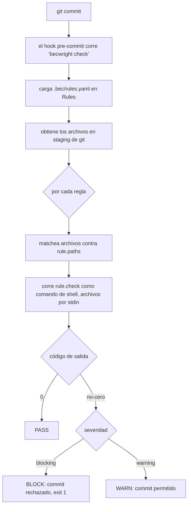

> [English](architecture.md) · **Español**

# Arquitectura

becwright es un motor chico que corre **checks** sobre tus archivos y decide si
un commit puede proceder. Es agnóstico al lenguaje: nunca parsea tu código —
filtra archivos por su ruta y corre un comando.

## Componentes

| Módulo | Responsabilidad |
|---|---|
| `cli.py` | CLI con argparse: `check / install / uninstall / export / import` |
| `rules.py` | El modelo `Rule` y la carga de `.bec/rules.yaml` |
| `engine.py` | Matching de rutas por glob, corre los checks, decide pasa/no-pasa |
| `git.py` | Raíz del repo, archivos en staging, el hook pre-commit nativo |
| `checks/` | Checks incluidos (un módulo cada uno) |
| `bundle.py` | Export/import de BECs (el `.bec.yaml` portable) |

El motor se distribuye como paquete instalado; el repo vigilado solo aporta su
propio `.bec/rules.yaml`. Ese desacople es lo que permite instalar becwright una
vez y usarlo en muchos repos.

## El flujo de chequeo

1. Un commit dispara el hook pre-commit, que corre `becwright check`.
2. becwright carga las reglas de `.bec/rules.yaml`.
3. Le pide a git los archivos en staging.
4. Por cada regla, filtra los archivos por los globs de `paths` y corre el
   comando `check` de la regla, pasándole los archivos que matchean por stdin.
5. El código de salida del check decide el resultado: `0` pasa; no-cero falla.
6. Si alguna regla **blocking** falló, el commit se rechaza (exit 1). Los avisos
   se imprimen pero nunca frenan.

## El contrato del check

El motor corre `rule.check` como comando de shell con `cwd` en la raíz del repo,
y le pasa las rutas relevantes (una por línea) por **stdin**. Un check:

- lee la lista de archivos por stdin,
- imprime las violaciones por stdout (se muestran bajo "Found in:"),
- sale **0** si todo está bien, **no-cero** si encontró una violación.

Como el contrato es solo "archivos por stdin, código de salida", un check se
puede escribir en cualquier lenguaje. Ver [writing-checks.es.md](writing-checks.es.md).

## Por qué es determinista

A diferencia de una nota en `CLAUDE.md` que le pide a un agente que se porte
bien, el check de una BEC corre sobre el código real en cada commit y devuelve
pasa/no-pasa sin importar quién o qué produjo el cambio. La regla lleva su
*intención* y su *por qué* (la parte "bound"), el check la vuelve *ejecutable*, y
un bundle la vuelve *portable* — ver [portability.es.md](portability.es.md).
