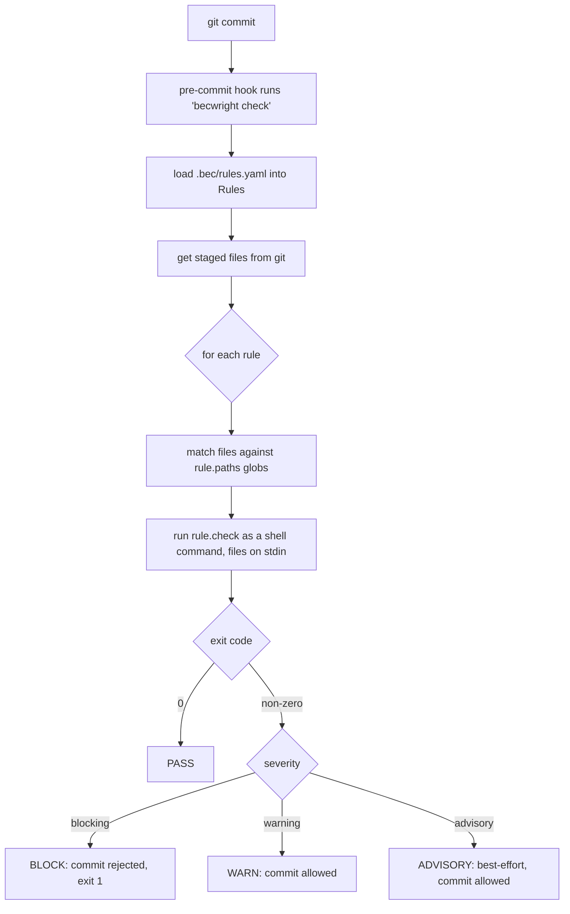

> **English** · [Español](architecture.es.md)

# Architecture

becwright is a small engine that runs **checks** against your files and decides
whether a commit may proceed. It is language-agnostic: it never parses your code
itself — it matches files by path and runs a command.

**The one-sentence version:** for every rule, becwright picks the files it
applies to and runs a small program (the "check"); if that program reports a
problem, a blocking rule stops the commit. Everything below is just that idea in
detail — the components, the exact flow, and the contract a check must follow.
The rest of this page is for the curious and for people writing their own checks.

## Components

| Module | Responsibility |
|---|---|
| `cli.py` | Argparse CLI: `init / list / check / check-msg / install / uninstall / export / import / add / search` |
| `rules.py` | The `Rule` model (incl. `severity`, `target`) and loading of `.bec/rules.yaml` |
| `engine.py` | Glob path matching, running checks (files or commit message), deciding pass/fail |
| `git.py` | Repo root, staged files, the native `pre-commit` and `commit-msg` hooks |
| `checks/` | Built-in checks (one module each) |
| `bundle.py` | Export/import of BECs (the portable `.bec.yaml`) |

The engine ships as an installed package; the repo being watched only contributes
its own `.bec/rules.yaml`. That decoupling is why becwright can be installed once
and used across many repos.

## The check flow

1. A commit triggers the `pre-commit` hook, which runs `becwright check`.
2. becwright loads the rules from `.bec/rules.yaml`.
3. It asks git for the staged files.
4. For each rule with `target: files`, it filters the files by the rule's `paths`
   globs and runs the rule's `check` command, passing the matching files on stdin.
5. The check's exit code decides the result: `0` passes; non-zero fails.
6. If any **blocking** rule failed, the commit is rejected (exit 1). `warning` and
   `advisory` findings are printed but never block (`advisory` is labelled
   best-effort, for non-deterministic checks like an LLM reviewer).

A separate `commit-msg` hook runs `becwright check-msg`, which applies the
`target: commit-msg` rules to the commit message the same way (the message is fed
to the check on stdin instead of file paths).

## The check contract

The engine runs `rule.check` as a shell command from the repo root and feeds it
the relevant file paths (one per line) on **stdin** — stdin is just the
program's standard input stream, the channel a command reads from. A check:

- reads the file list from stdin,
- prints any violations to stdout (shown under "Found in:"),
- exits **0** if everything is fine, **non-zero** if it found a violation.

Because the contract is just "files on stdin, exit code out", a check can be
written in any language. See [writing-checks.md](writing-checks.md).

## Why it is deterministic

Unlike a note in `CLAUDE.md` that asks an agent to behave, a BEC's check runs
against the real code on every commit and returns pass/fail regardless of who or
what produced the change. The rule carries its *intent* and *why* (the "bound"
part), the check makes it *executable*, and a bundle makes it *portable* — see
[portability.md](portability.md).
